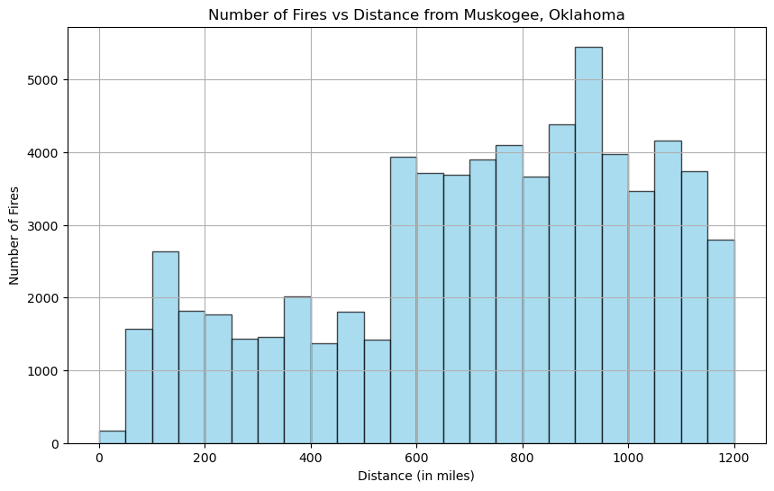

# Muskogee, Oklahoma Wildfire Analysis

This research aims to provide a thorough examination of the impact of wildfires in Muskogee, Oklahoma by estimating the effects of smoke over the last six decades. The study involves a multifaceted approach, encompassing data extraction, filtering, smoke estimation, correlation analysis with Air Quality Index (AQI) data, and the development of a forecasting model to project future smoke concentrations.

## Repository Structure

```bash
.
├── images
│   ├── AQI vs Smoke Impact (Min-Max Scaling).png
│   ├── AQI vs Smoke Impact.png
│   └── Histogram.png
│   ├── Predictive Model.png
│   └── Total Acres Burned Per Year.png
├── src
│   ├── reference-notebooks
│       ├── epa_air_quality_history_example.ipynb
│       └── wildfire_geo_proximity_example.ipynb
│   ├── aqi-data.ipynb
│   └── wildfire-data.ipynb
│   ├── functions.py
│   └── smoke-estimator.ipynb
│   └── data-analysis-and-visualizations.ipynb
├── wildfire
│   ├── Reader.py
├── README.md
├── LICENSE
├── Reflections.pdf
```
### Repository Information

> - `src/aqi-data.ipynb` - Notebook that extracts the AQI data for Muskogee, Oklahoma
> - `src/wildfire.ipynb` - Notebook read the raw file containing information of all wildfires and calculates the geodetic distance between the place of the wildfire and the city.
> - `src/functions.py` - Python file containing helper functions used in wildfire.ipynb. The functions here are taken from the reference notebook.
> - `src/smoke-estimator.ipynb` - Calculates the smoke impact estimator for all the wildfires. These values are then used for the visualizations.
> - `src/data-analysis-and-visualizations.ipynb` - Contains all the visualizations and the predictive model for the next 25 years.

## Introduction

Wildfires have become increasingly prevalent and severe, posing significant challenges to communities and ecosystems. Muskogee County, like many other regions, has witnessed the detrimental effects of wildfire-induced smoke. This research seeks to understand the historical patterns of smoke in the county over the past 60 years, with a focus on quantifying its impact on air quality.

## Methodology

### Wildfire Data

The research focuses on a Common Analysis Research Topic utilizing the [Wildland Fire Combined Dataset by USGS.json](https://www.sciencebase.gov/catalog/item/61aa537dd34eb622f699df81). This comprehensive dataset, compiled by the US Geological Survey, encompasses wildland fire polygons in the United States and various territories dating from the 1800s to the present. Documentation accompanying the dataset ensures transparency and understanding. Available in both ArcGIS and GeoJSON formats, the dataset serves as the foundational element for our individual research projects.

Each researcher has been assigned a specific US city, detailed in a Google spreadsheet. The city assigned here is **Muskogee, Oklahoma**. This city will be the focal point for our unique investigations, utilizing the extensive and well-documented wildland fire dataset to explore patterns, trends, and implications related to wildfires in our respective regions.

An example notebook under the Creative Commons CC-BY License, located at: `src/reference-notebooks/wildfire_geo_proximity_example.ipynb`. This notebook was used as a reference to get the wildfire data for a particular city, in our case we used it to get the wildfire data for Muskogee, Oklahoma.

### AQI Data

For our comprehensive analysis, we integrate Air Quality Index (AQI) data sourced from the US Environmental Protection Agency (EPA) via an API. This API serves as a vital tool for retrieving real-time and historical AQI information specifically tailored to Muskogee, Oklahoma.

By leveraging the EPA's data through this API, we gain valuable insights into the air quality conditions in Muskogee. The AQI, a standardized measure, allows us to assess the levels of various pollutants, providing a quantitative understanding of the potential health risks associated with air pollution in the region.

An example notebook under the Creative Commons CC-BY license with all steps and different processes used to get the AQI data is located at: `src/reference-notebooks/epa_air_quality_history_example.ipynb`.

### Data Location

The data used (or generated) throughout the analysis is located in a Google Drive: https://drive.google.com/drive/folders/1yFBJI2Wcvlb03Z_4gHqJLhdMF2BQQp-M?usp=sharing

- `USGS_Wildland_Fire_Combined_Dataset.json` - A GeoJSON file that contains the wildfire data across the united states from 1800s - present.

- `muskogee_wildfire.json` - This file contains the raw data generated using the data above with specific filters to get data only around the specified city.

- `muskogee.csv` - Contains the filtered and cleaned data from the raw file. This file is used later in the analysis step.

- `smoke-estimators` - The smoke impact estimators for each wildfire is located in this file. These values are used for the visualizations.

- `avg-aqi-yearly.csv` - A csv file that has the AQI data for Muskogee, Oklahoma on a yearly average basis.

### Data Filtering:

The dataset employed for our analysis and subsequent visualizations undergoes a meticulous filtering process to ensure relevance and accuracy. The three distinct filters applied contribute to refining and focusing the scope of the data:

1. **Temporal Filter (Last 60 Years):**

   The analysis primarily considers wildland fires that transpired within the temporal window of the last 60 years, specifically from 1963 to 2023.

2. **Spatial Filter (Within 1250 Miles):**

   To narrow down the dataset to events with potential regional impact, the estimation selectively includes fires that occurred within a radius of 1250 miles from the assigned city.

3. **Seasonal Filter (May 1st - October 31st):**

   Acknowledging the seasonal variability of wildfire occurrences, an annual fire season is defined, spanning from May 1st through October 31st.

By applying these filters, our analysis ensures a targeted investigation into the impact of wildland fires, offering a nuanced perspective that considers both temporal evolution and geographical proximity to the assigned city. This refined dataset serves as the foundation for generating meaningful visualizations and drawing insights that are not only accurate but also highly relevant to the specific context of our study.

### Smoke Estimation:

The methodology employed for smoke estimation in this analysis revolves around a proximity impact approach, emphasizing the significance of both distance and fire size in determining the extent of smoke impact. Two crucial factors, proximity, and fire size, are considered to quantitatively assess the potential influence of wildfires on the study area.

1. **Proximity Impact:**

   The distance between the wildfires and the designated study area plays a pivotal role in our smoke estimation. The rationale behind this criterion is that the closer a wildfire is to the region of interest, the more substantial its impact on air quality and environmental conditions is likely to be. By prioritizing proximity, we aim to capture the localized effects of wildfires, recognizing that their influence diminishes with increasing distance.

2. **Fire Size Consideration:**

   In addition to proximity, the size of the wildfires is a key determinant in our smoke estimation model. Larger fires inherently have the potential to produce more significant amounts of smoke, even at a considerable distance. Therefore, the methodology takes into account the dual influence of both proximity and fire size to provide a more nuanced and realistic representation of the potential impact on the study area.

**Formula for Smoke Impact**

    smoke_impact = (-decay_rate * distance) * fire_size

By incorporating these factors into our smoke estimation model, we aim to generate a more accurate and context-specific understanding of the potential consequences of wildfires on air quality. This dual approach ensures that the analysis not only considers the immediate vicinity of wildfires but also acknowledges the varying degrees of impact based on the size of the fires, thereby contributing to a more comprehensive assessment of the environmental effects of wildland fires.

## Visual Analytics

### 1. Histogram



The image above shows the number of fires every 50 miles from the city of Muskogee, Oklahoma.

### 2. Time Series


The above image shows a time series graph of the total number of acres burned as a result of wildfires for each year between 1963 - 2023.

### 3. AQI vs Smoke Estimator


The image above shows two different lines on the same plot. The avg AQI per year and the corresponding smoke estimator calculated.

To make the smoke estimator line more readable wrt to the AQI, we have also tried using min-max scaling. The result is the following image.

.png>)

### Predictive Model


The image above shows the predicted smoke_impact values for the next 25 years.

## Reproducing the Analysis

### 1. Clone the Repository

Begin by making a local copy of this repository. You can do this by running the following command in your terminal or command prompt:
```bash
git clone https://github.com/saumya-nauni/data-512-project.git
```

### 2. Download and Extract the Dataset

- You can download the `GeoJSON Files.zip` from this [link](https://www.sciencebase.gov/catalog/item/61aa537dd34eb622f699df81). Once you have this downloaded you will see the `USGS_Wildland_Fire_Combined_Dataset.json` file.
- Alternatively, you can use the [Google Drive](https://drive.google.com/drive/folders/1yFBJI2Wcvlb03Z_4gHqJLhdMF2BQQp-M?usp=sharing) to download the same dataset.

### 3. Execute the Notebook Cells

- First start by running the cells in the `wildfire-data.ipynb` notebook. You can change the city here according to your use. The result of this step would give you two files: the raw data file (`muskogee-wildfire.json`) and the cleaned file (`muskogee.csv`)
- The second step is run to the `smoke-estimator.ipynb` notebook to get all values of the smoke_impact for each wildfire. The result is the dataset `smoke-estimators.csv`
- The next step is to get the avg AQI values for each year. For this run the cells in the `aqi-data.ipynb` notebook. The result would be the dataset `avg-aqi-yearly.csv`
- Last, you would have to run the `data-analysis-and-visualizations.ipynb` notebook to get all the visualizations along with the predictive model.

## License

This project is licensed under the MIT License - see the LICENSE file for details.
